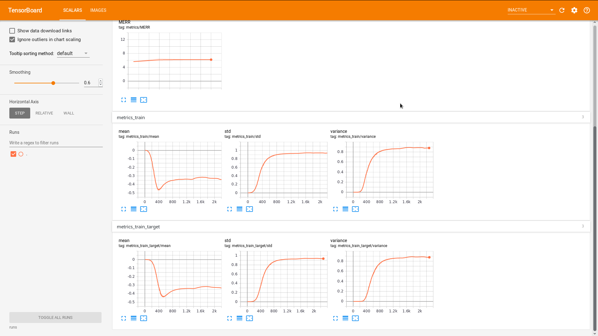
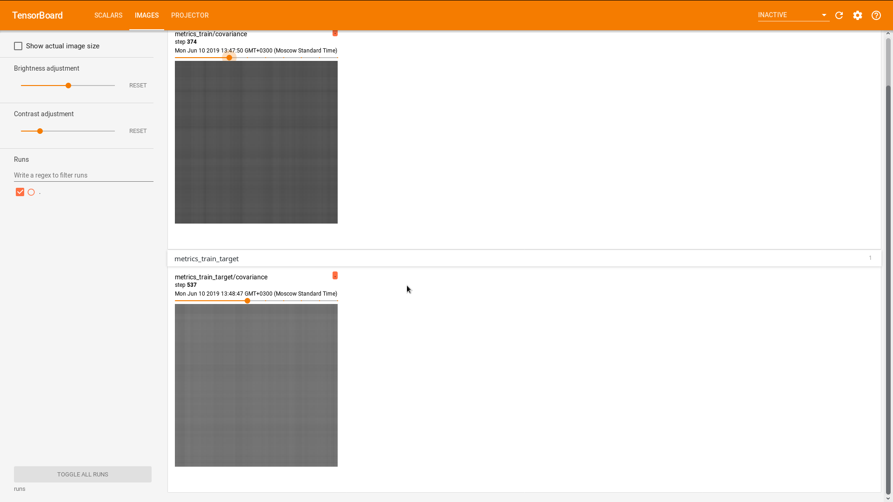
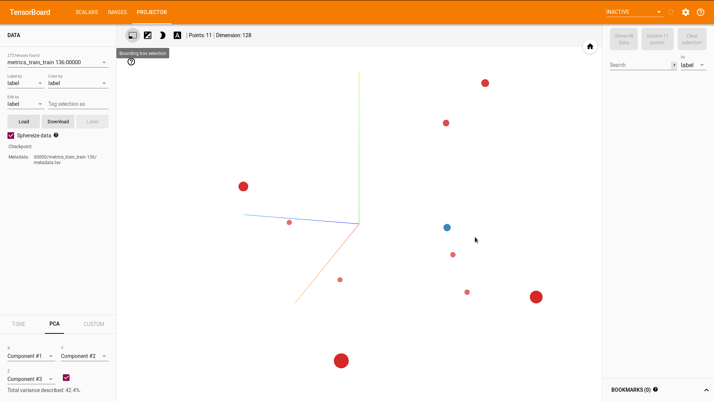

# RecNN: RL news recommendation

This project is built for MovieLens 20M dataset, but support for other datasets is in perspective.
I have parsed all the movies in the '/links.csv' to get all auxiliary data from TMDB/IMDB. Text information was fed into Google's BERT/ OpenAI GPT2 models to get text embeddings. All the data can be found [here](https://drive.google.com/file/d/1TclEmCnZN_Xkl3TfUXL5ivPYmLnIjQSu/view?usp=sharing)


I also added static HDF5 dataset support so it takes ~7-10 minutes to get through al the ML20M dataset. Dynamically built it used to take about 2 hours but now you can iterate through 40GB od data in a matter of 10 minutes! You can generate the static data yourself, or download the existing one here. I will upload it this evening.

## How to use static MovieLens Dataset in your project

```
import h5py

# include the file
f = h5py.File("*path to the static dataset*", "r")

# set some constants
batch = []
batch_size = 5000
n_batches = (f['state'].shape[0] // batch_size) + 1

def prepare_batch(*args):
	# device - torch.device cpu/cuda
    args = [torch.tensor(np.array(arg).astype(np.float)).to(device) for arg in args]
    return args

def prepate_batch_keras():
	

# interate throught the batches
for i in range(n_batches):
	# get the batch
    batch = [f[key][i*batch_size:(i+1)*batch_size] for key in
             ['state', 'action', 'reward', 'next_state', 'done']]
    
    # do your framework-specific thing
    batch = prepare_batch(*batch)
	
	# do whatever you want here
	
    batch = []
```

## Data description:

All text information is located in `texts_bert.p / texts_gpt2.p` in a dict {movie_id: numpy_array} format.

All of cat features had been label encoded, numerical standardized.

I also added the SARSA-like static HDF5 file with following datasets

- State - [None, frame_size * (embed_size+1) ] - PCA encoded previous actions (watched movies) embedding + rewards (ratings). All flattered and connected together
- Action - [None, embed_size] - PCA encoded current action embedding
- Reward - [None] - Integer, indicates whether the user liked the action or not
- Next state - look state - + Next state is basically the same but shifted +1 time step
- Done - [None] - Boolean, needed for TD(1)

Here is an example of how the movie info looks like:


```python
{'adult': False,
 'collection': 210,
 'genres': [14, 1, 11],
 'original_language': 0,
 'popularity': 5.218749755002595,
 'production_companies': [96],
 'production_countries': [0],
 'release_year': 1995,
 'release_month': 10,
 'revenue': 4.893588591235185,
 'runtime': -0.5098445413830461,
 'spoken_languages': [0],
 'title': 'Toy Story',
 'vote_average': 1.2557064312220563,
 'vote_count': 1.8032194192281197,
 'budget': 1.1843770075921112,
 'revenue_d': 5.626649137875692}
```

## Also added some debug information for the 





### Medium Articles (Deep Reinforcement Learning for News Recommendation)
I wrote some medium articles explaining how this works:
  -  [ Part 1: Architecture.](https://towardsdatascience.com/deep-reinforcement-learning-for-news-recommendation-part-1-architecture-5741b1a6ed56)
  -  Part 2: Simple implementation DDPG. 
  - (In Progress) Part 3: D4PG. 
  - (In Progress) Part 4: Rainbow and ODEs. 

### Key Notes
  - Written in Pytorch 1.0
  - DDPG with D4PG support (WIP).
  - Notebooks may be found /notes
  - Ready-to-ship project will be located in /build


### Todo (Not implemented)

- Write Articles as I implement this
- Docker Support

### Done:
- H5Py support with static dataset

License
----

THE SOFTWARE IS PROVIDED "AS IS", WITHOUT WARRANTY OF ANY KIND, EXPRESS OR IMPLIED, INCLUDING BUT NOT LIMITED TO THE WARRANTIES OF MERCHANTABILITY, FITNESS FOR A PARTICULAR PURPOSE AND NONINFRINGEMENT. IN NO EVENT SHALL THE AUTHORS OR COPYRIGHT HOLDERS BE LIABLE FOR ANY CLAIM, DAMAGES OR OTHER LIABILITY, WHETHER IN AN ACTION OF CONTRACT, TORT OR OTHERWISE, ARISING FROM, OUT OF OR IN CONNECTION WITH THE SOFTWARE OR THE USE OR OTHER DEALINGS IN THE SOFTWARE.

