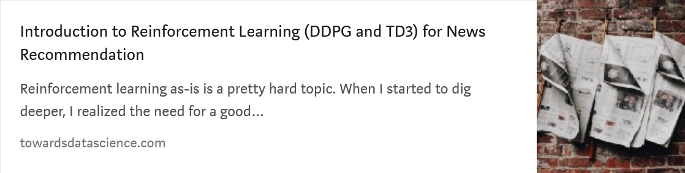

<p align="center"> 

</p>

<p align="center"> 

<a href='https://recnn.readthedocs.io/en/latest/?badge=latest'>
    
</a>

<a href='https://circleci.com/gh/awarebayes/RecNN'>
    
</a>

<a href="https://codeclimate.com/github/awarebayes/RecNN/maintainability">
    
</a>

<a href="https://github.com/awarebayes/RecNN">
    
</a>

<a href="https://colab.research.google.com/github/awarebayes/RecNN/">
    
</a>

<a href="https://github.com/psf/black">
    
</a>
</p>


<p align="center"> 
This is my school project. It focuses on Reinforcement Learning for personalized news recommendation. The main distinction is that it tries to solve online off-policy learning with dynamically generated item embeddings. I want to create a library with SOTA algorithms for reinforcement learning recommendation, providing the level of abstraction you like.
</p>

<p align="center">
    <a href="https://recnn.readthedocs.io">recnn.readthedocs.io</a>
</p>

### 📊 The features can be summed up to

- Abstract as you decide: you can import the entire algorithm (say DDPG) and tell it to ddpg.learn(batch), you can import networks and the learning function separately, create a custom loader for your task, or can define everything by yourself.

- Examples do not contain any of the junk code or workarounds: pure model definition and the algorithm itself in one file. I wrote a couple of articles explaining how it functions.

- The learning is built around sequential or frame environment that supports ML20M and like. Seq and Frame determine the length type of sequential data, seq is fully sequential dynamic size (WIP), while the frame is just a static frame.

- State Representation module with various methods. For sequential state representation, you can use LSTM/RNN/GRU (WIP) 

- Parallel data loading with Modin (Dask / Ray) and caching

- Pytorch 1.7 support with Tensorboard visualization.

- New datasets will be added in the future.

## 📚 Medium Articles

The repo consists of two parts: the library (./recnn), and the playground (./examples) where I explain how to work with certain things. 

 -  Pretty much what you need to get started with this library if you know recommenders but don't know much about
  reinforcement learning:

<p align="center"> 
   <a href="https://towardsdatascience.com/reinforcement-learning-ddpg-and-td3-for-news-recommendation-d3cddec26011">
        
    </a>
</p>

 -  Top-K Off-Policy Correction for a REINFORCE Recommender System:
<p align="center"> 
   <a href="https://towardsdatascience.com/top-k-off-policy-correction-for-a-reinforce-recommender-system-e34381dceef8">
        
    </a>
</p>


## Algorithms that are/will be added

<p align="center"> 
    
| Algorithm                             | Paper                            | Code                       |
|---------------------------------------|----------------------------------|----------------------------|
| Deep Q Learning (PoC)                 | https://arxiv.org/abs/1312.5602  | examples/0. Embeddings/ 1.DQN |
| Deep Deterministic Policy Gradients   | https://arxiv.org/abs/1509.02971 | examples/1.Vanilla RL/DDPG |
| Twin Delayed DDPG (TD3)               | https://arxiv.org/abs/1802.09477 | examples/1.Vanilla RL/TD3  |
| Soft Actor-Critic                     | https://arxiv.org/abs/1801.01290 | examples/1.Vanilla RL/SAC  |
| Batch Constrained Q-Learning          | https://arxiv.org/abs/1812.02900 | examples/99.To be released/BCQ |
| REINFORCE Top-K Off-Policy Correction | https://arxiv.org/abs/1812.02353 | examples/2. REINFORCE TopK |

</p>

### ‍Repos I used code from

 -  Sfujim's [BCQ](https://github.com/sfujim/BCQ) (not implemented yet)
 -  Higgsfield's [RL Adventure 2](https://github.com/higgsfield/RL-Adventure-2) (great inspiration)

### 🤔 What is this

<p align="center"> 
This is my school project. It focuses on Reinforcement Learning for personalized news recommendation. The main distinction is that it tries to solve online off-policy learning with dynamically generated item embeddings. Also, there is no exploration, since we are working with a dataset. In the example section, I use Google's BERT on the ML20M dataset to extract contextual information from the movie description to form the latent vector representations. Later, you can use the same transformation on new, previously unseen items (hence, the embeddings are dynamically generated). If you don't want to bother with embeddings pipeline, I have a DQN embeddings generator as a proof of concept.
</p>


## ✋ Getting Started
<p align="center"> 
<a href="https://colab.research.google.com/drive/1xWX4JQvlcx3mizwL4gB0THEyxw6LsXTL"></a>
</p>

<p align="center"> 
<a href="https://colab.research.google.com/drive/1xWX4JQvlcx3mizwL4gB0THEyxw6LsXTL"></a>
</p>


p.s. Image is clickable. here is direct link:
<a href="https://colab.research.google.com/drive/1xWX4JQvlcx3mizwL4gB0THEyxw6LsXTL">
    
</a>

To learn more about recnn, read the docs: <a href="https://recnn.readthedocs.io">recnn.readthedocs.io</a> 

### ⚙️ Installing

```
pip install git+git://github.com/awarebayes/RecNN.git
```

PyPi is on its way...

### 🚀 Try demo

I built a [Streamlit](https://www.streamlit.io/) demo to showcase its features.
It has 'recommend me a movie' feature! Note how the score changes when you **rate** the movies. When you start
and the movies aren't rated (5/10 by default) the score is about ~40 (euc), but as you rate them it drops to <10,
indicating more personalized and precise predictions. You can also test diversity, check out the correlation of
recommendations, pairwise distances, and pinpoint accuracy.

Run it:
```
git clone git@github.com:awarebayes/RecNN.git 
cd RecNN && streamlit run examples/streamlit_demo.py
```

[Docker image is available here](https://github.com/awarebayes/recnn-demo)

## 📁 Downloads
 -  [MovieLens 20M](https://grouplens.org/datasets/movielens/20m/)
 -  [Movie Embeddings](https://drive.google.com/open?id=1EQ_zXBR3DKpmJR3jBgLvt-xoOvArGMsL)
 -  [Misc Data](https://drive.google.com/open?id=1TclEmCnZN_Xkl3TfUXL5ivPYmLnIjQSu)
 -  [Parsed (omdb,tmdb)](https://drive.google.com/open?id=1t0LNCbqLjiLkAMFwtP8OIYU-zPUCNAjK)

## 📁 [Download the Models](https://drive.google.com/file/d/1goGa15XZmDAp2msZvRi2v_1h9xfmnhz7/view?usp=sharing)

## 📄 Citing
If you find RecNN useful for an academic publication, then please use the following BibTeX to cite it:

```
@misc{RecNN,
  author = {M Scherbina},
  title = {RecNN: RL Recommendation with PyTorch},
  year = {2019},
  publisher = {GitHub},
  journal = {GitHub repository},
  howpublished = {\url{https://github.com/awarebayes/RecNN}},
}
```
