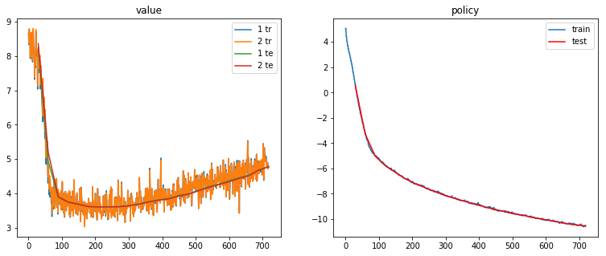
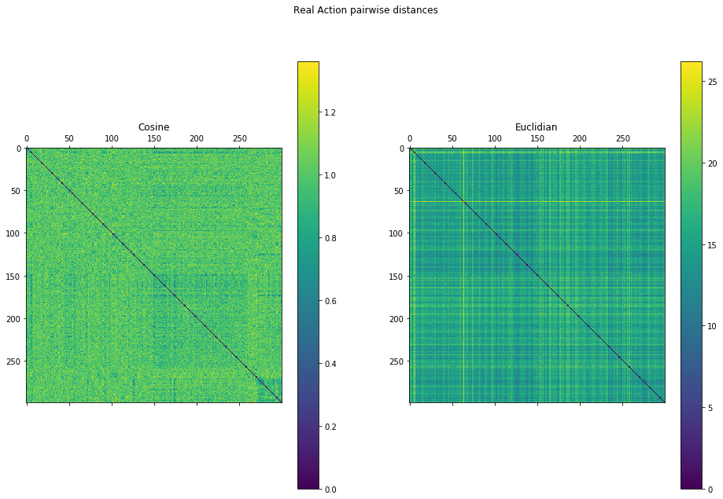
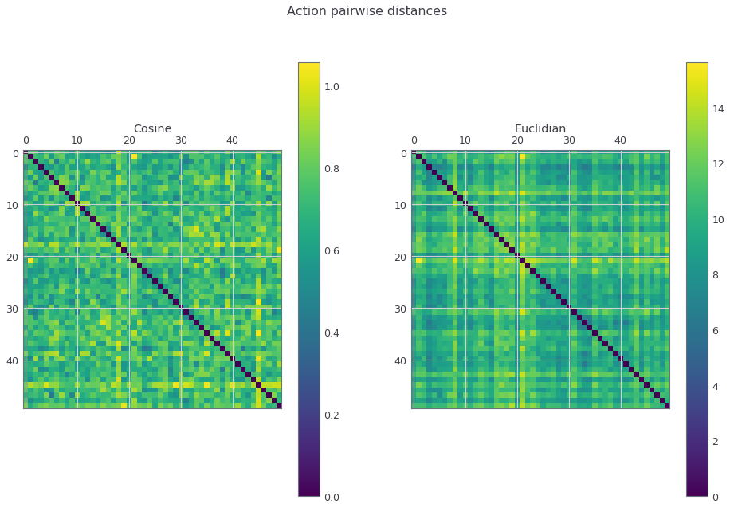
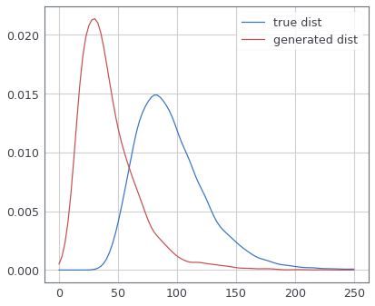

<p align="center"> 

</p>

This is my school project. It focuses on Reinforcement Learning, but there are many other things I learned during the development. Key topics: time series analysis, static dataset optimization, data preparation, and EDA. It also features my code for ML20 dataset that allows iterating through the dataset in a matter of 3 minutes. As well as my custom movie embeddings. DDPG doesn't seem to be working because it exploits the Value Network by recommending the same movie over and over again. But TD3 seems to be working just fine! You can see the distance matrices for the generated actions [below](#td3-results)


## Dataset Description
This project is built for MovieLens 20M dataset, but support for other datasets is in perspective. I have parsed all the movies in the '/links.csv' to get all auxiliary data from TMDB/IMDB. Text information was fed into Google's BERT/ OpenAI GPT2 models to get text embeddings. If you want to download anything, the links are down the description. 

I also added static SARSA-like HDF5 dataset support so it takes ~3 minutes to get through all the ML20M dataset. Dynamically built it used to take about 2 hours but now you can iterate through 40GB of data in a matter of 3 minutes! You can generate static data yourself or [download it here](https://drive.google.com/open?id=1pPf-7AmUVceVfgfmKEJ6ireEDKEJHw-7).

Here is an overview:

- State - [None, frame_size * (embed_size+1) ] - PCA encoded previous actions (watched movies) embedding + rewards (ratings). All flattered and connected together
- Action - [None, embed_size] - PCA encoded current action embedding
- Reward - [None] - Integer, indicates whether the user liked the action or not
- Next state - look state - + Next state is basically the same but shifted +1 time step
- Done - [None] - Boolean, needed for TD(1)

## Misc Data

Everything of the misc sort is in the 'Misc Data' you can download in the downloads section, featuring all sorts of auxiliary stuff. Primarily it is movie info. If you don't want to use the embeddings, or just want to have some debug info/data for application this is what you need.

All text information is located in texts_bert.p / texts_gpt2.p in a dict {movie_id: numpy_array} format.

All of the categorical features had been label encoded, numerical standardized.

Here is an example of how the movie information looks like:

```python
{'adult': False,
 'collection': 210,
 'genres': [14, 1, 11],
 'original_language': 0,
 'popularity': 5.218749755002595,
 'production_companies': [96],
 'production_countries': [0],
 'release_year': 1995,
 'release_month': 10,
 'revenue': 4.893588591235185,
 'runtime': -0.5098445413830461,
 'spoken_languages': [0],
 'title': 'Toy Story',
 'vote_average': 1.2557064312220563,
 'vote_count': 1.8032194192281197,
 'budget': 1.1843770075921112,
 'revenue_d': 5.626649137875692}
```

## How to use static MovieLens Dataset in your project

```
import h5py

# include the file
f = h5py.File("*path to the static ml20m dataset*", "r")
movie_ref = pickle.load("path to the pca/umap movie embeddings")

# set some constants
batch = []
batch_size = 5000
n_batches = (f['state'].shape[0] // batch_size) + 1

def prepare_batch(*args):
    # device - torch.device cpu/cuda
    args = [torch.tensor(np.array(arg).astype(np.float)).to(device) for arg in args]
    return args

# iterate throught the batches
for i in tqdm(n_batches):
    movies, ratings, done = [f[key][i*batch_size:(i+1)*batch_size] for key in
             ['movies', 'ratings', 'done']]
    
    movies, ratings, done = [torch.tensor(i.astype('float32')) for i in [movies, ratings, done]]
    movies_tensor = torch.stack([torch.stack([movie_ref[int(i)] for i in ts]) for ts in movies])
    
    state = torch.cat([movies_tensor[:, :-1, :].view(state.size(0), -1),
                       ratings[:, :-1]], 1)
    next_state = torch.cat([movies_tensor[:, 1:, :].view(state.size(0), -1),
                            ratings[:, 1:]], 1)
    action = movies_tensor[:, -1]
    reward = ratings[:, -1]
    
    batch = [state, action, reward, next_state, done]
    
```

## Getting started:

1. Download the static ml20m dataset and the movie embeddings or generate yourself with the original ML20m (might take an hour)
2. Clone this repo
3. Place the static_ml20m.hdf5 and infos_pca128.pytorch (embeddings) into the RecNN/data folder
4. Run notes/3. DDPG and see the results

P.S. as for today TD3 is not working. I am focusing on the DDPG. I will work later.

## DDPG results (WIP)

Please, head over to notes/3.DDPG to see all the losses during the training, as well as other metrics. I often update the repo, so the results you see above are not always the best ones. 

Here you can see the training process of the network:

<p align="center"> 

</p>

Here is a pairwise similarity matrix of real and generated actions (movie embeddings)

<p align="center"> 

</p>
 

<p align="center"> 

</p>

It doesn't seem to overfit much. Here you can see the Kernel Density Estimation for Autoencoder Reconstruction scores. I use it as an anomaly detection metric. (Wasserstein Distance = ~50)

<p align="center"> 

</p>

 # Downloads
- [Static ML20M dataset](https://drive.google.com/open?id=1pPf-7AmUVceVfgfmKEJ6ireEDKEJHw-7)
- [Movie Embeddings](https://drive.google.com/open?id=1kTyu05ZmtP2MA33J5hWdX8OyUYEDW4iI)
- [State Representation Model](https://drive.google.com/open?id=1DuNvPQ8pIxmZEFGNtXRSRxRcoWXU_0cO)
- [Misc Data](https://drive.google.com/open?id=1TclEmCnZN_Xkl3TfUXL5ivPYmLnIjQSu)

## FAQ:

**What are the films ids?**
 
 It uses movies.csv from ML20M. The field is movieId
 
 **Something in the RL Losses looks weird**
 
It is fine for the RL losses. Keep in mind that RL algorithms utilize neural networks for calculating the loss functions (Policy Loss) or some wacky stuff like Temporal Difference bootstapping with target network for Value Loss.
 
 **What is the size of ...?**
 
| Name       || Dimensions  | Base Type |
|------------||----------------|-----------|
| State      || 1290           | float     | 
| Action     || 128            | float     | 
| Reward     || 1              | int8      | 
| Next_State || 1290           | float     | 
| Done       || 1              | bool      | 

P.S. all types are downcasted to float32 in the PyTorch backend.

## Medium Articles (WIP)
I wrote some medium articles explaining how this works:
  -  [ Part 1: Architecture.](https://towardsdatascience.com/deep-reinforcement-learning-for-news-recommendation-part-1-architecture-5741b1a6ed56)
  - (In Progress) Part 2: Simple implementation DDPG. 
  - (In Progress) Part 3: TD3.

License
----

THE SOFTWARE IS PROVIDED "AS IS", WITHOUT WARRANTY OF ANY KIND, EXPRESS OR IMPLIED, INCLUDING BUT NOT LIMITED TO THE WARRANTIES OF MERCHANTABILITY, FITNESS FOR A PARTICULAR PURPOSE AND NONINFRINGEMENT. IN NO EVENT SHALL THE AUTHORS OR COPYRIGHT HOLDERS BE LIABLE FOR ANY CLAIM, DAMAGES OR OTHER LIABILITY, WHETHER IN AN ACTION OF CONTRACT, TORT OR OTHERWISE, ARISING FROM, OUT OF OR IN CONNECTION WITH THE SOFTWARE OR THE USE OR OTHER DEALINGS IN THE SOFTWARE.

